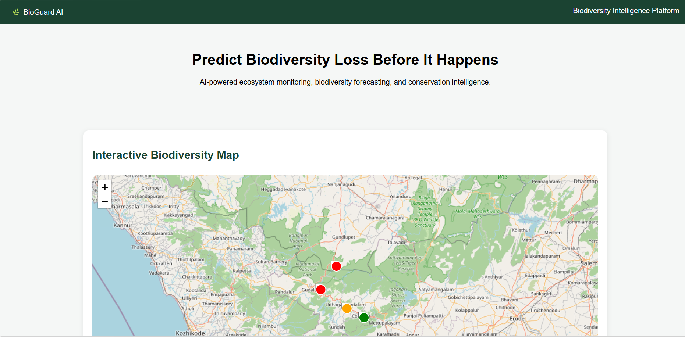
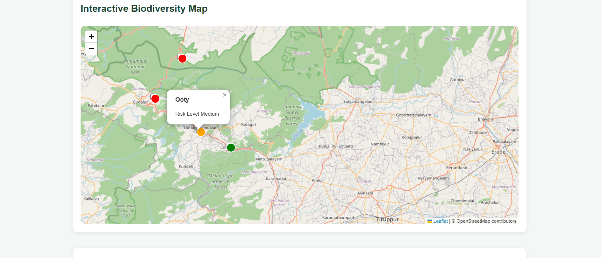
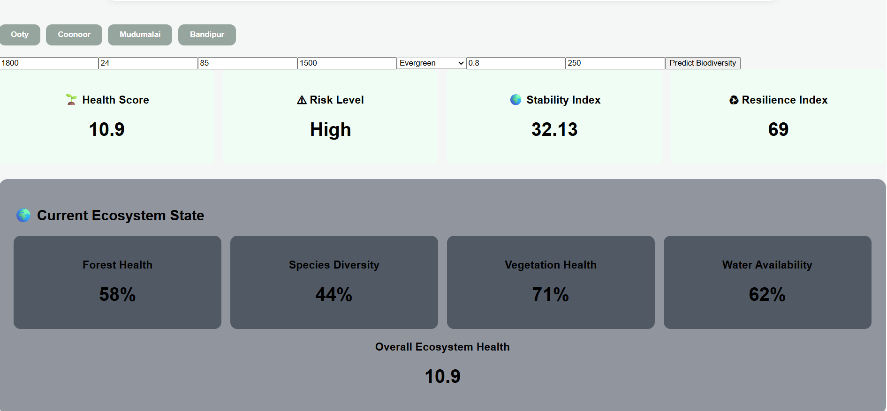
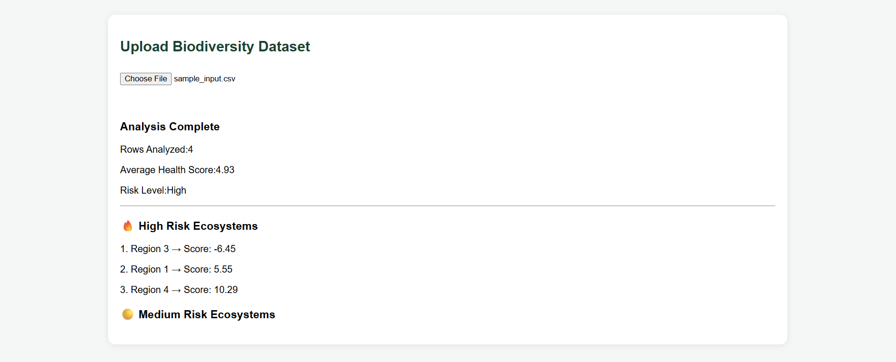
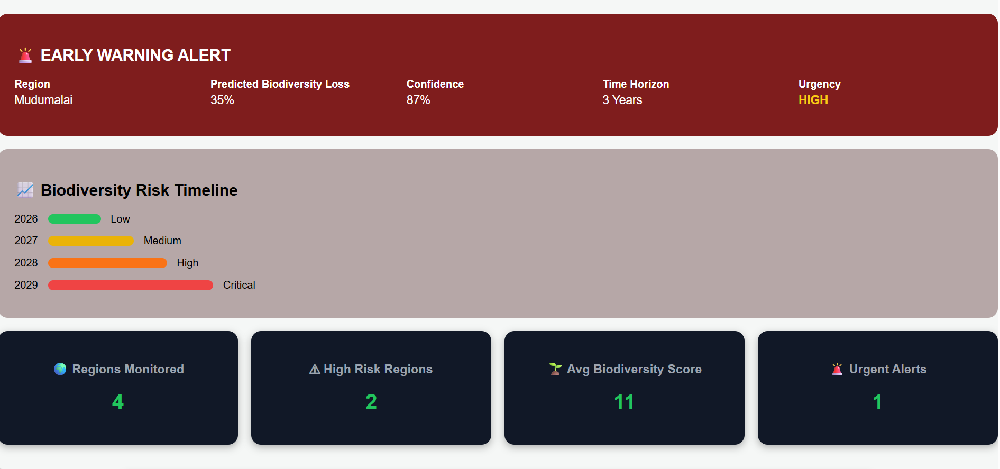
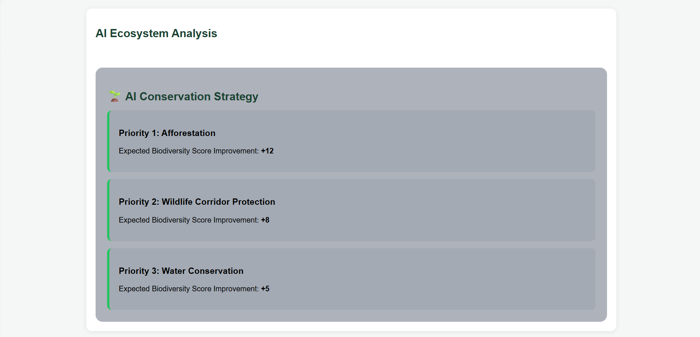
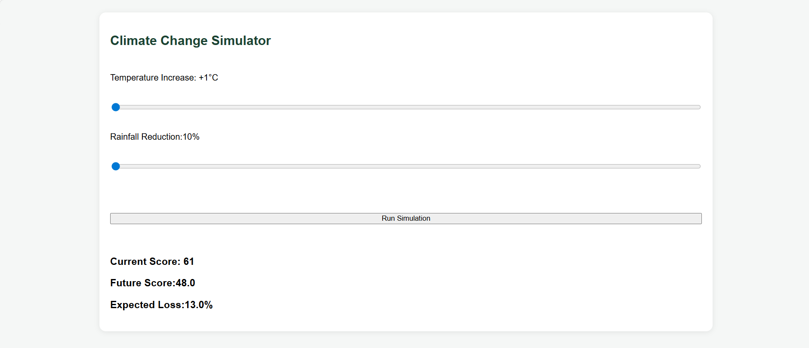
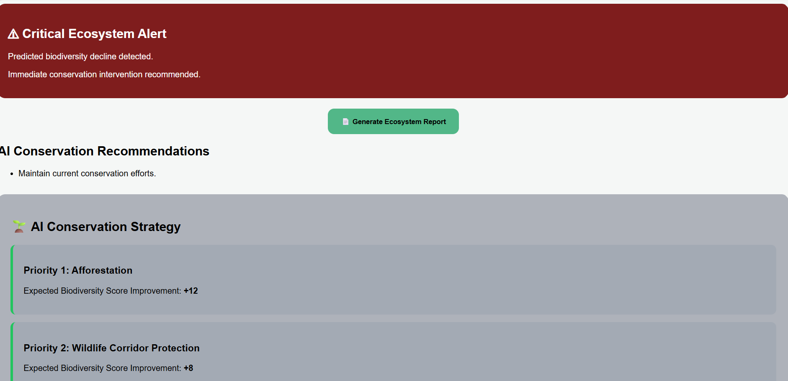
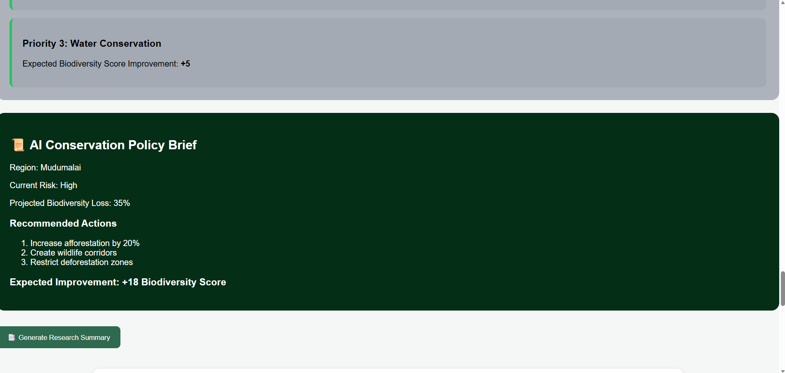
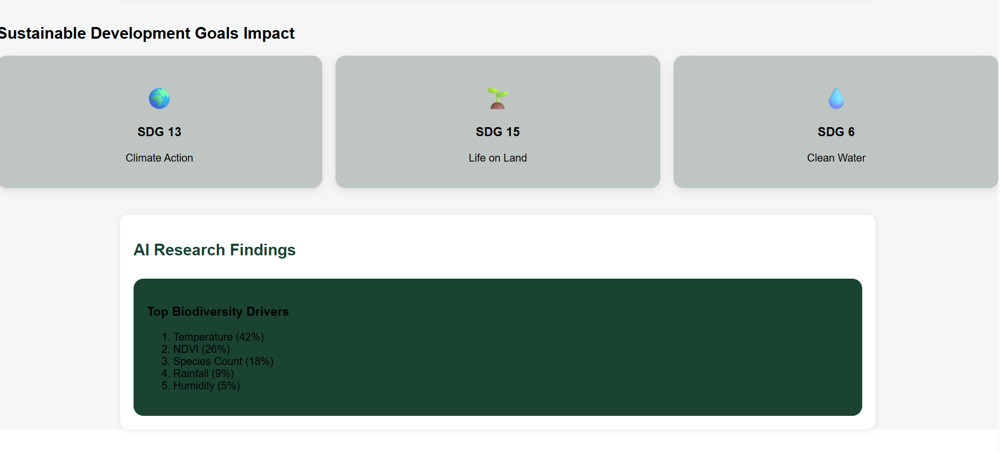

# 🌿 BioGuard AI

### AI-Powered Biodiversity Intelligence & Early Warning Platform

BioGuard AI is an advanced biodiversity monitoring and ecosystem intelligence platform that leverages Artificial Intelligence, Machine Learning, Explainable AI (XAI), geospatial visualization, and conservation analytics to identify biodiversity risks before irreversible ecosystem degradation occurs.

The platform enables environmental researchers, conservation agencies, policymakers, NGOs, and sustainability organizations to assess ecosystem health, predict biodiversity decline, generate conservation strategies, and support evidence-based environmental decision-making.

---
🎥 Demo Video

▶️ Watch the full demonstration here:

https://youtu.be/UtvMpS5E58U

📸 Project Screenshots

🏠 Home Page

🌍 Interactive Biodiversity Map

📊 Regional Biodiversity Analysis

🔬 Ecosystem Assessment Dashboard

⚠ Biodiversity Early Warning Alerts

🌱 Conservation Strategy Recommendations

🌡 Climate Change Impact Simulator

📄 Automated Report Generation

📑 Summary Report Generation

🔍 Explainable AI (SHAP Analysis)

🎯 Sustainable Development Goals Impact

BioGuard AI is an advanced biodiversity monitoring and ecosystem intelligence platform that leverages Artificial Intelligence, Machine Learning, Explainable AI (XAI), geospatial visualization, and conservation analytics to identify biodiversity risks before irreversible ecosystem degradation occurs.

The platform enables environmental researchers, conservation agencies, policymakers, NGOs, and sustainability organizations to assess ecosystem health, predict biodiversity decline, generate conservation strategies, and support evidence-based environmental decision-making.

## 🚀 Key Features

### 🌍 Interactive Biodiversity Risk Map

* Visual ecosystem monitoring dashboard
* Region-wise biodiversity assessment
* Color-coded risk classification
* Interactive conservation intelligence interface

### 🤖 AI Biodiversity Prediction Engine

* XGBoost Regression Model
* Predicts Biodiversity Health Score
* Ecosystem Stability Index
* Biodiversity Resilience Index
* Species Risk Classification

### ⚠ Biodiversity Early Warning System

* Predicts future biodiversity decline
* Risk forecasting over multiple years
* Urgency-based ecosystem alerts
* Preventive conservation recommendations

### 📈 Biodiversity Forecasting

* Multi-year biodiversity trend analysis
* Future ecosystem health projections
* Risk timeline visualization
* Climate impact forecasting

### 🔍 Explainable AI (SHAP)

* Model transparency and interpretability
* Feature importance visualization
* Biodiversity driver analysis
* Research-grade explainability

### 🌱 AI Conservation Strategy Planner

Provides actionable recommendations:

* Afforestation Planning
* Wildlife Corridor Protection
* Species Conservation Programs
* Water Resource Management

### 📜 AI Conservation Policy Advisor

Generates policy-oriented insights:

* Regional risk assessment
* Conservation priorities
* Intervention strategies
* Expected ecosystem improvement

### 🌍 Ecosystem Digital Twin

Visual representation of:

* Forest Health
* Species Diversity
* Vegetation Health
* Water Availability
* Overall Ecosystem Health

### 📊 Dataset Intelligence

* Upload biodiversity datasets
* Batch ecosystem assessment
* Hotspot identification
* High-risk region ranking

### 📄 Automated Report Generation

Generate downloadable PDF reports containing:

* Biodiversity assessment
* Ecosystem indicators
* Risk classification
* Conservation recommendations

### 🎯 Sustainable Development Goals (SDGs)

Aligned with:

* SDG 13 – Climate Action
* SDG 15 – Life on Land
* SDG 6 – Clean Water and Sanitation

---

## 🏗 Technology Stack

### Frontend

* React.js
* Axios
* Leaflet Maps
* Chart.js
* CSS3

### Backend

* FastAPI
* Python
* Pandas
* NumPy

### Machine Learning

* XGBoost Regressor
* SHAP Explainability
* Scikit-Learn

### Visualization

* Recharts
* SHAP Summary Plots
* Interactive Dashboards

---

## 🧠 Machine Learning Performance

| Metric   | Score             |
| -------- | ----------------- |
| Model    | XGBoost Regressor |
| R² Score | 0.988             |
| MAE      | 1.27              |

The model was trained using biodiversity and environmental indicators including rainfall, temperature, humidity, elevation, vegetation health (NDVI), forest type, and species count.

---

## 📂 Input Features

| Feature          | Description                 |
| ---------------- | --------------------------- |
| Rainfall_mm      | Annual Rainfall             |
| Temperature_C    | Average Temperature         |
| Humidity_Percent | Relative Humidity           |
| Elevation_m      | Elevation                   |
| Forest_Type      | Forest Classification       |
| NDVI             | Vegetation Health Index     |
| Species_Count    | Species Diversity Indicator |

---

## 🌱 Example Workflow

1. Select a biodiversity region
2. View ecosystem indicators
3. Run AI assessment
4. Generate biodiversity forecast
5. Analyze SHAP explanations
6. Receive conservation recommendations
7. Download ecosystem report

---

## 📊 Research Applications

BioGuard AI can support:

* Biodiversity Monitoring
* Ecosystem Risk Assessment
* Conservation Planning
* Environmental Policy Analysis
* Climate Change Adaptation Studies
* Ecological Research
* Sustainability Decision Support

---

## 🎯 Future Roadmap

* Real-Time Satellite Data Integration
* Remote Sensing Analytics
* Biodiversity Digital Twin Expansion
* Conservation Impact Simulation
* Multi-Region Monitoring
* Government Decision Support Portal
* Mobile Application
* Global Biodiversity Risk Dashboard

---

## 👩‍💻 Author

**Charuhasini P**

Artificial Intelligence & Data Science Student

Sri Eshwar College of Engineering

---

## 🌍 Vision

To build intelligent biodiversity monitoring systems that empower conservation agencies, researchers, and policymakers to predict ecosystem degradation early and take proactive measures to protect biodiversity for future generations.

---

### “Predict Biodiversity Loss Before It Happens.”
